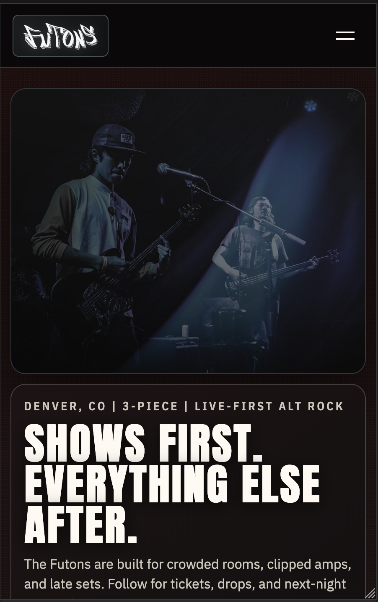
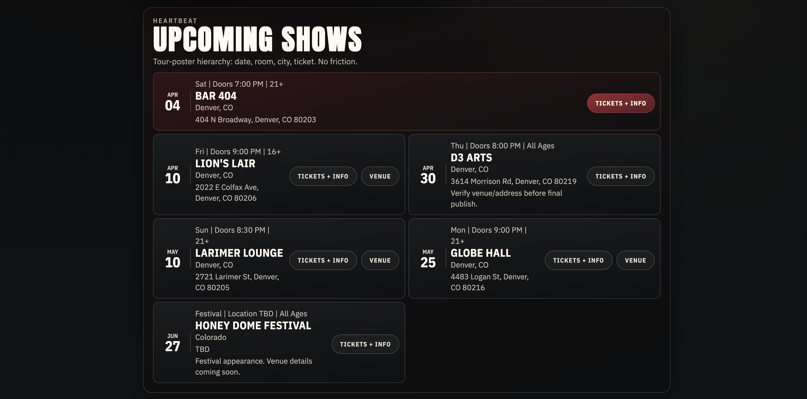

# The Futons - Band Website

A static website for The Futons, a band based out of Denver, CO.

<p align="center">
  
</p>

## Features

- Hero section with band logo and Spotify link
- Music page with latest releases and direct Spotify links
- Photo gallery with lightbox viewer
- Band member profiles
- Upcoming show listings with booking info
- Contact form powered by Web3Forms

## Preview

<p align="center">
  
</p>

<p align="center">
  
</p>

## Getting Started

1. Clone the repository:

```bash
git clone https://github.com/ZacksBroDev/Fotuns.git
cd Fotuns
```

2. Start a local server:

```bash
# Using Python
python3 -m http.server 3000

# Using Node.js
npx serve . -p 3000
```

3. Open http://localhost:3000 in your browser.

## Tech Stack

- HTML5, CSS3, JavaScript (ES6+)
- Modern CSS with gradients, animations, and responsive design
- Web3Forms for contact form handling
- Compatible with static hosts (GitHub Pages, Netlify, Vercel, etc.)

## Project Structure

```
├── index.html              # Main website file
├── styles/
│   └── style.css           # All styling
├── assets/
│   ├── icons/              # Logos and social media icons
│   └── img/                # Band photos and gallery images
└── README.md               # This file
```

## Customization

- **Colors**: Edit CSS variables in `styles/style.css`
- **Content**: Update text, links, and images in `index.html`
- **Photos**: Replace images in `assets/img/`
- **Contact Form**: Swap in your Web3Forms access key in the form

## Deployment

This is a static site and can be hosted anywhere:

- **GitHub Pages**: Push to GitHub and enable Pages in the repo settings
- **Netlify**: Drag and drop the folder or connect your GitHub repo
- **Vercel**: Connect directly to the GitHub repository
- **Traditional hosting**: Upload all files to any web server

## License

© 2025 The Futons. Developed by ZackFullStack
